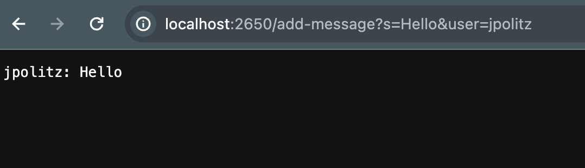
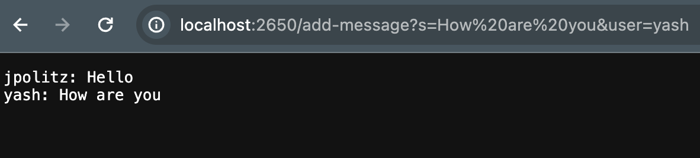
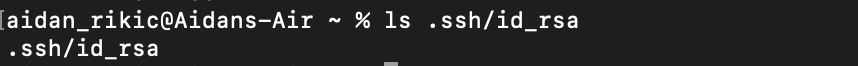
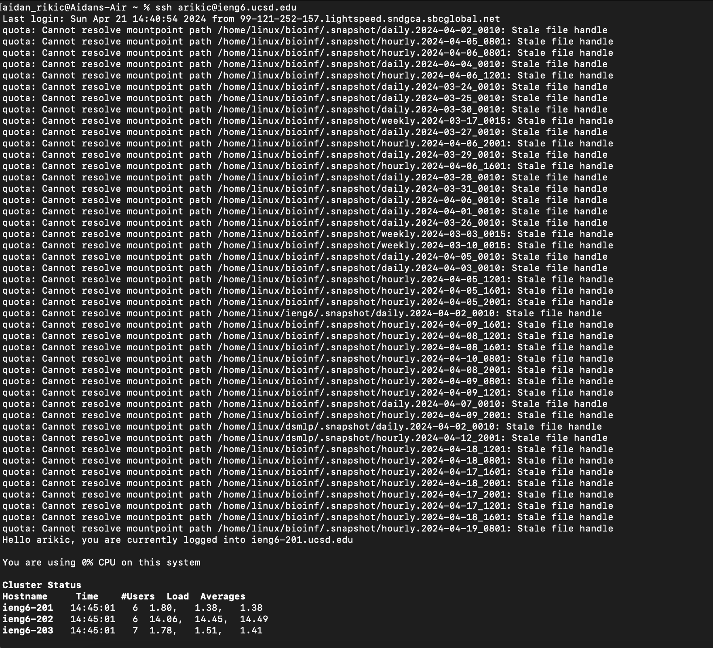

# Lab Report 2 
## Aidan Rikic

**Part1**   

``` 
import java.io.IOException;
import java.net.URI;

class Handler implements URLHandler {
    String current = "";

    public String handleRequest(URI url){
        if(url.getPath().equals("/")){
            return current;
        }
        else if(url.getPath().equals("/add-message")){
            String queryString = url.getQuery();
            /* s=Hello&user=jpolitz */
            String[] message = queryString.split("&");
            System.out.println(message);

            /* s=Hello  user=jpolitz */
            String[] userArray = message[1].split("=");
            /* message[1] should be user=jpolitz and get split into user jpolitz  */
            String userString = userArray[1].toString();

            String[] sArray = message[0].split("=");
            /* message[0] should be s=Hello and get split into s Hello */
            String sString = sArray[1].toString();

            current += userString+": "+sString+"\n";
        }
        return current;
    }
}

class ChatServer {
    public static void main(String[] args) throws IOException {
        if(args.length == 0){
            System.out.println("Missing port number! Try any number between 1024 to 49151");
            return;
        }
        int port = Integer.parseInt(args[0]);

        Server.start(port, new Handler());
    }
}
```

SS 1 of /add-message  
  
1. In this implementation of ChatServer, the method being called is `String handleRequest`.  
2. The relevant argument to `String handleRequest` is the `URI url` and the field `String current` which is empty and is what gets added to as we use the ChatServer.
3. The field `String current` is added to based off the query given in `url`, in which we add the user name and the message they give.  

SS 2 of /add-message  
  
1. In this implementation of ChatServer, the method being called is `String handleRequest`.  
2. The relevant argument to `String handleRequest` is the `URI url` and the field `String current` which is empty and is what gets added to as we use the ChatServer.
3. The field `String current` is added to based off the query given in `url`, in which we add the user name and the message they give.  


**Part 2**  
  
  
  

**Part 3**  
In the lab this week I learned how ssh keys work and how they are stored between my own computer and the ieng6 system. I also learned a little bit more on how to handle urls for certain changes made to a website, and how to control those. 
